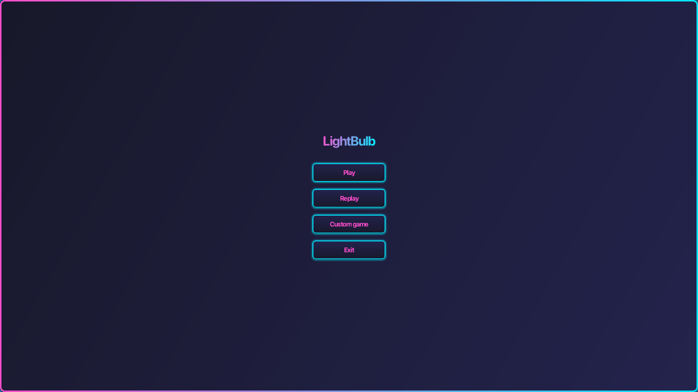
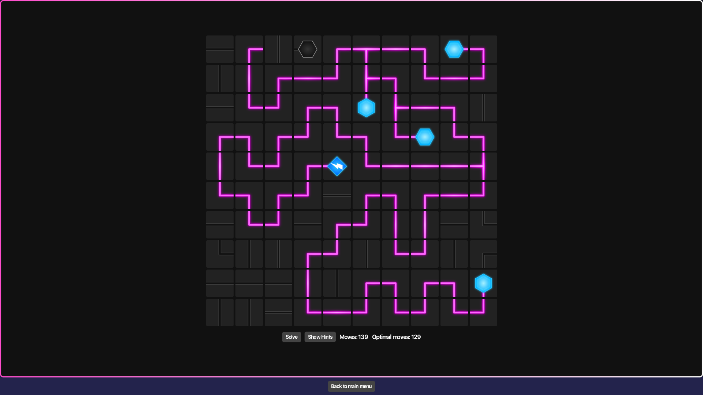
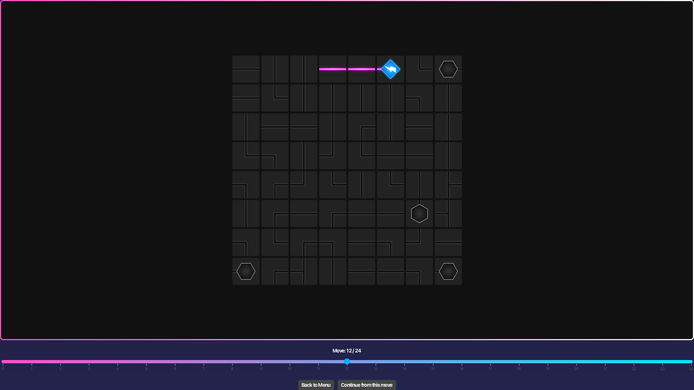

# 💡 LightBulb Puzzle Game

A clean JavaFX-based logic game inspired by mobile Light Bulb Puzzle apps.

---

## 🎯 Game Goal

Connect a single power source to all bulbs by rotating tiles and completing a circuit. The board includes:

- **Straight (`I`)**: connects two opposite sides  
- **Elbow (`L`)**: connects two perpendicular sides  
- **T-junction (`T`)**: connects three sides  
- **Cross (`X`)**: connects all four sides  
- **Source (`S`)**: emits electricity  
- **Bulb (`B`)**: lights up when powered

All bulbs must be lit to win.

---

## 🚀 Features

- Three **game modes**: easy, medium and hard 
- Level generation with **DFS** algorithm
- Custom game mode
- Timed mode
- **Replay mode** with **undo/redo** steps
- **Autosolve** feature  
- **MVC** architecture  
- **Move counter**  
- **Helper window** with number of correct steps
- **Real-time** power visualization


---

## 🛠️ Requirements

- Java 21+  
- Maven 3.8+  
- (Optional) Make

---

## ▶️ Run Instructions

```bash
git clone ...

make         # or: mvn clean package
make run     # or: mvn javafx:run
```

---

## 📁 Structure

```
lightbulbgame/
├── Makefile
├── pom.xml
├── README.md
├── requirements.md
└── src/
    ├── main/java/...      # App code
    ├── main/resources/... # Assets (CSS, images)
    └── test/java/...      # Unit tests
```

---

## 👥 Authors

- Filip Hladík  – UI, replay mode, time mode
- Maksim Samusevich  – game logic, model, level generation

---

## 📝 Screenshots
*Menu of the game*

*Example of generated hard level*

*Replay mode, where you can load your saved games and replay it from any step using bottom scroll*

